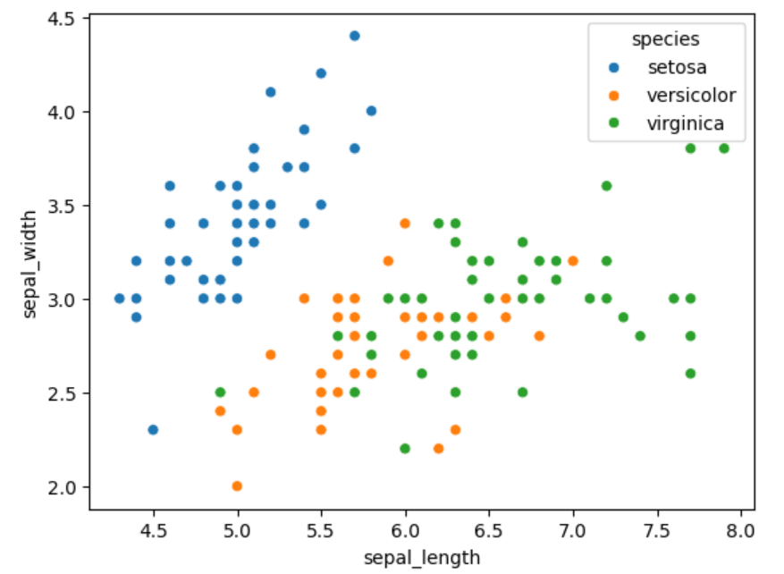
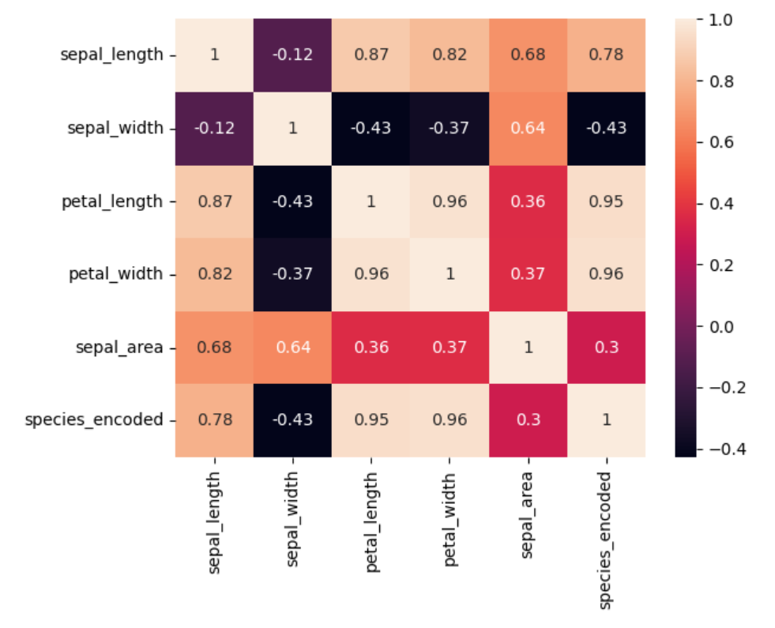
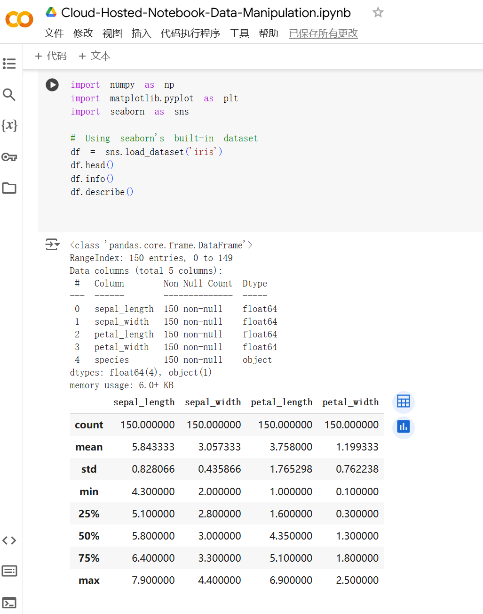
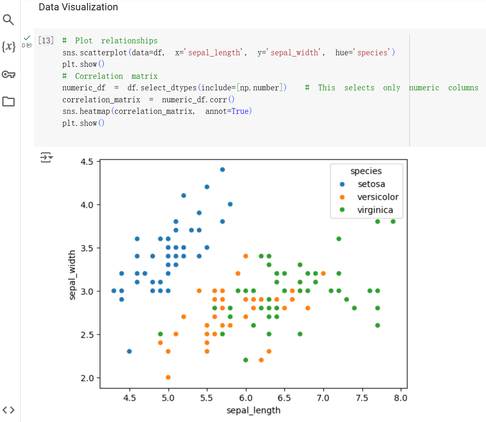

# Data Manipulation in a Cloud-Hosted Jupyter Notebook

This project demonstrates data manipulation tasks performed on the Iris dataset using a cloud-hosted Jupyter Notebook on Google Colab. The notebook includes data cleaning, transformation, and visualization techniques.

### Link to the cloud-hosted notebook
https://colab.research.google.com/drive/1aUabTa7cE115lhwugV5UN66RnDhHrRDw?usp=sharing
## Setup and Installation

### Prerequisites

- Python 3.6 or higher
- Jupyter Notebook or Google Colab
- Git

### Setting Up the Cloud-Hosted Jupyter Notebook

#### Using Google Colab

1. **Access Google Colab**: Navigate to [Google Colab](https://colab.research.google.com/).
2. **Sign In**: Use your Google account credentials.
3. **Create a New Notebook**:
   - Click on **"File"** > **"New Notebook"**.
4. **Rename the Notebook**:
   - Click on the notebook name at the top (usually "Untitled.ipynb") and rename it to `data_manipulation.ipynb`.
5. **Set Up the Environment**:
   - Install necessary libraries by running the following command in a cell:
     ```python
     !pip install pandas numpy matplotlib seaborn
### Installation Steps

1. **Clone the Repository**

   ```bash
   git clone https://github.com/your_username/your_repository.git

2. Navigate to the Project Directory

   ```bash
   cd your_repository

3. Install Dependencies

    ```bash
    pip install -r requirements.txt

4. Open the Notebook

    Locally:

    ```bash
    jupyter notebook your_notebook.ipynb

On Google Colab:

Upload the notebook to your Google Drive.
Open with Google Colab.

## Usage
Run each cell sequentially to perform data manipulation tasks on the Iris dataset, including:

1. Data Exploration: Understanding the structure and summary of the data.
2. Data Cleaning: Handling missing values and correcting data types.
3. Feature Engineering: Creating new features from existing ones.
4. Data Visualization: Visualizing data distributions and relationships.
## Data Manipulation Tasks
The notebook performs a series of data manipulation tasks on the Iris dataset.
- Viewing Data Structure
    ```bash
    df.head()
    df.info()
    df.describe()
-  Data Cleaning
    ```bash
    df.isnull().sum()
    df.dropna(inplace=True)
-  Data Transformation
    ```bash
    df['sepal_area'] = df['sepal_length'] * df['sepal_width']
    df['species_encoded'] = df['species'].astype('category').cat.codes
-  Data Visualization (Scatterplot)
    ```bash
    sns.scatterplot(data=df, x='sepal_length', y='sepal_width', hue='species')
    plt.title('Sepal Length vs Sepal Width')
    plt.show()


-  Data Visualization (Heatmap)
    ```bash
    sns.heatmap(df.corr(), annot=True, cmap='coolwarm')
    plt.title('Feature Correlation Matrix')
    plt.show()


## CI/CD Pipeline
[](https://github.com/iikikk/Cloud-Hosted-Notebook-Data-Manipulation/actions/workflows/ci.yml)

This project uses GitHub Actions for the CI/CD pipeline, which includes three stages:

Build: Installs dependencies specified in requirements.txt.
Test: Runs tests using pytest and nbval to ensure the notebook runs without errors.
Lint: Checks code quality using flake8 after converting notebooks to scripts.
The pipeline is defined in .github/workflows/ci.yml.

## Colab Screenshot


